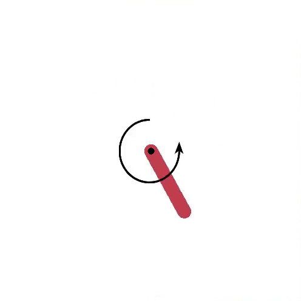

# Deep Deterministic Policy Gradients
This is an implementation of Deep Deterministic Policy Gradients as described in this [paper](https://arxiv.org/abs/1509.02971). DDPG is an actor-critic method designed for continous action spaces. First, I implemented DDPG to work for the OpenAI gym's Pendulum environment where the agent must learn to invert and balance a pendulum. The agent can apply a torque on the joint at each time step to make the pendulum achieve its goal. The control signal is continuous which is a big change from the other Deep RL approaches I have worked on so far. You could try to discretize the space and apply DQN or DDQN but that would not likely scale well to higher dimensional problems! The key insight of DDPG is that the Q-function, mapping a (state, action) -> (value), is now differentiable with respect to the action. For an environment with discrete actions, our Q-function was discontinous with respect to the actions because they were disrcete. This allows us to have a gradient based method improve our policy function. For more details, check out the pseudo code below <br /> 

[]

# Results
### Mujoco Environments
The Mujoco Physics Simulator (Multi-Joint Dynamics with Contact) has a few OpenAI gym environments for simple robots with continuous control. I implemented DDPG with the same hyper parameters as the original DDPG [paper](https://arxiv.org/abs/1509.02971) and applied it to the Hopper-V2 and Cheetah environments. The Hopper and Cheetah environments feature robots who must learn what torques to apply to their motors in order to produce forward translation. <br />

The agent's learned policy is pretty unstable! It has short periods where it hops really well but then some weight updates push it toward pretty poor gaits. The neural networks are pretty shallow right now. Hopefully a larger network would be more robust. Another approach could be to reduce the action space noise or to move away from action space noise and instead use parameter space noise. Below is the agent's cumulatative reward per episode of training. The agent's learned policy is pretty unstable! It has short periods where it hops really well but then some weight updates push it toward pretty poor gaits. The neural networks are pretty shallow right now. Hopefully a larger network would be more robust. Another approach could be to reduce the action space noise or to move away from action space noise and instead use parameter space noise. A video of the Hopper learning is available [here](https://youtu.be/E0tvLX5sxv0?t=281). <br />
Learned Policy             |  Reward Per Epoch over Time
:-------------------------:|:-------------------------:
[]  | []

<br />

Below is a gif of the Cheetah's learned policy. A video of the agent training is available [here](https://youtu.be/DQCQSEspLhs). <br />
[]


### Custom OpenAI Gym Environment in PyBullet
I created my own custom gym environment in PyBullet. I wanted to simulate a hopping robot walking on soft ground. PyBullet does not support granular materials in this sense so I simulated the robot's foot interacting with granular materials in Chrono, gathered a dataset, and trained a neural network to map the robot's state to the ground reaction forces and moments of torque. I then used this neural network to apply forces and torques on the robot's foot as it interacted with the bed of granular material. I still need to add a way to visualize where in space the granular material is. Below is an image of the robot in its home position. More details can be found in the h3pper directory. <br />
[]

### Classic Control Environments
I also implemented DDPG for OpenAI's pendulum environment. The agent can apply a continous control in the interval of [-1, 1] that maps to continous torques generated by the pendulum's motor. Below is a gif of the learned policy <br />
[]


# Activating the Virtual Environment 
```source env_name/bin/activate``` <br />

# Setting Up Virtual Environment 
```python3 -m venv env_name``` <br /> 
```source env_name/bin/activate``` <br />
```pip3 install --upgrade pip``` <br />
```python3 -m pip install --upgrade setuptools``` <br />
```pip install tensorflow=2.0.0``` Make sure Tensorflow2, not Tensorflow1 is installed <br />
```pip install keras``` <br />
```pip install gast==0.2.2```  This fixes a issue reported by Tensorflow <br />
```pip install pybullet```

To setup Mujoco, follow these [instructions](https://www.chenshiyu.top/blog/2019/06/19/Tutorial-Installation-and-Configuration-of-MuJoCo-Gym-Baselines/) but instead of using an Anaconda virtual environment, use a Python virtual environment <br />

# Transfering Code to Beast
```scp -r -P 922 DDPG/ peterj@beast.mech.northwestern.edu:RL```
