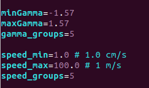

# Description
This directory has the code required for creating a dataset of the foot interacting with the granular material as it is being extracted from the material.

# How to Compile
Copy the folder over to Kronos, and run ```mkdir build```, ```mkdir logs```, ```cd build```, and then ```cmake ..```

# How to Run
```./createDataSet.sh``` <br />
It is a good idea to run the above from a tmux session. If you ssh connection is broken while the program runs, your executable will stop. To prevent this, use tmux. A primer on tmux can be found [here](https://tmuxcheatsheet.com/).  

# How to Edit the Input Space
Open ```createDataSet.sh``` and edit the lines which define the min and max values for each item of the input space. You can also define the discretization level of each item in the input space by editing its associated _groups variable. For example, in the below image are the lines we need to modify to change the input space data. <br />
 <br />
With this setup, we will run the extract.cpp executable 25 times. Each run of the executable will have diffrent command line arguments specifying the speed of the foot and the gamma value. Within each run of the executable, the beta value will be varied. So, this setup will evenly generate data across the input space of (speed, gamma, beta).       


# Files in Repo  
```createDataSet.sh```: Highest level file. Runs intrude.cpp many times with diffrent command line args in order to generate data over the entire input space we care about. <br />
```extract.cpp```: DEM simulation of the plate being extracting from the granular material <br />
```setup.json```: Defines parameters of the DEM simulation <br /> 
```CMakeLists.txt```: For build system <br />
```README.md```

