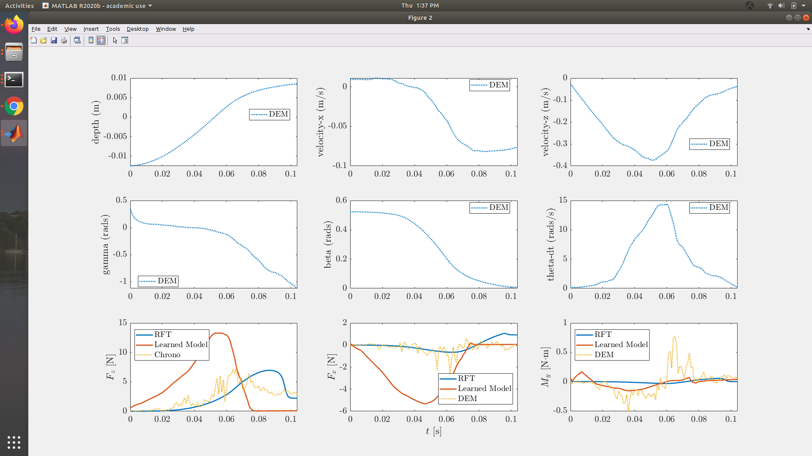
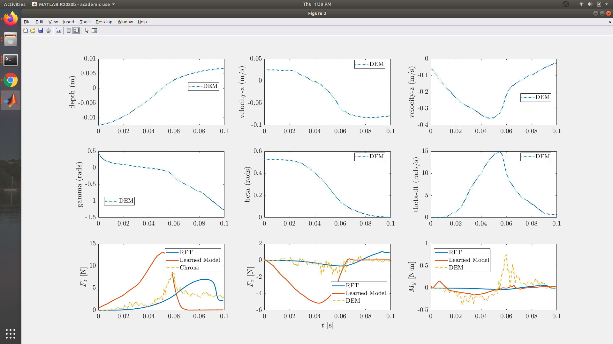
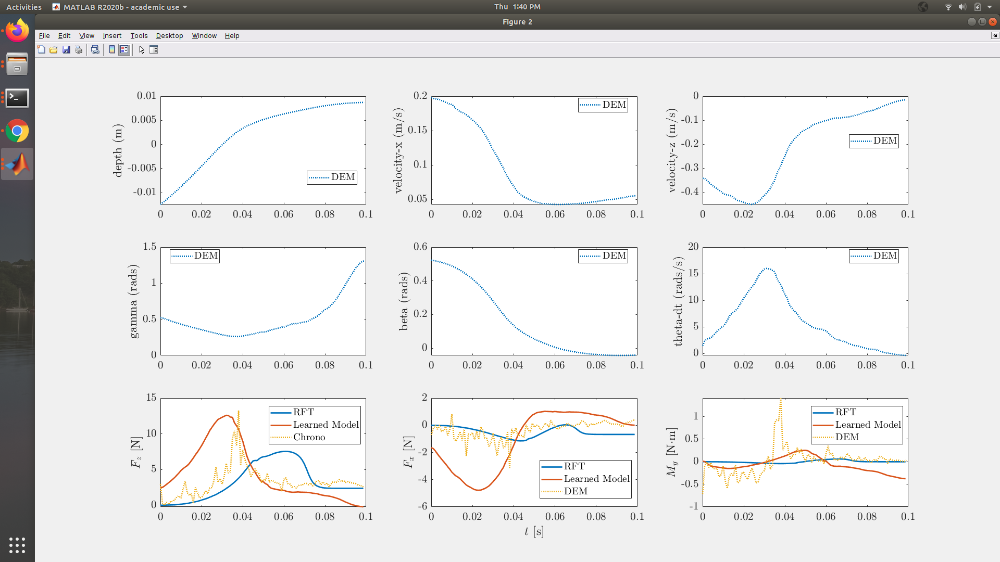

# Description
This directory has everything required for comparing the neural network ground reaction model to the DEM data and the RFT data.  

# DEM Dataset For DEM/RFT/Neural Net Comparison
The dataset Juntao and Dan used over the summer should go in the dataset folder. There are 4-5 simulations worth of DEM simulations with each one having the plate hit the ground at diffrent speeds. The plate is not driven or forced into the granular material. The dataset files are too big for me to commit because of Github's size limits. I zipped the folder and put it in my google drive. Here is the link to the folder, https://drive.google.com/file/d/1bKOJLMaauMwVOnheWvTxcKUSMF-ULI9f/view?usp=sharing  

# DEM Dataset for Training the Neural Net 
I created a dataset to train the neural network on. The DEM simulations drive the plate through the granular material at speeds ranging from 1.0 cm/s to 100.0 cm/s. This dataset is too large for me to put on Github because of its large file size limits. The link to the dataset is [here](https://drive.google.com/file/d/1GkRHntBAKGFLWmFBmqRF3KvPMmSSSJs4/view?usp=sharing)  

# How to Recreate My Graphs
## Train the Models
Running ```python3 processData.py``` will read in the dataset, create a neural network, and learn from it. The neural network is saved as ```model.h5```. To use the neural network, open the groundReaction.m file and put in the new path to the model.h5 file.      

## Compare the Models
In Matlab, run <br /> 
```init_env.m```, ```init_params.m``` then run ```eval_foot_gpm("path_to_simulation_data")``` <br />

The path_to_simulation_data is the global path to one of the directories in the dataset/unforced_gpm/ directories. For example, on my computer, in Matlab, I would run ```eval_foot_gpm("/home/peterjochem/Desktop/Deep_RL/DDPG/h3pper/createGroundModel/validateModel/DEM_RFT_Comparisons/dataset/unforced_gpm/data_set/v_minus_5")```. This will do the comparisons of both models and the ground truth simulation data for a single simulation of the experiment. Each experiment uses a diffrent velocity and so you need to run ```eval_foot_gpm("path_to_simulation_data") ``` on each directory in dataset/unforced_gpm/data_set/ to view how the model performs across a wide range of velocities. 

# Results
The dataset in this directory has a few sub-directories. Each one has the foot intrude into the granular material at a different initial speed. The foot is not forced into the material as it collides. For each trajectory, we plot the ground reaction force-x, ground reaction force-z, and moment as the DEM data says it is (yellow), RFT calculates it (blue), and how the neural network computes it (orange). The RFT and neural network calculations are not used to influence the foot's trajectory, we are simply recomputing what the ground reactions forces and moments are at each time step given the state of the foot in the DEM simulation. <br />     

The neural network is trained on an independent dataset than the trajectories shown below in yellow. 

Below are the results of eval_foot_gpm on each trajectory from the DEM data.  

Custom PyBullet Environment             |  Reward Per Epoch over Time
:-------------------------:|:-------------------------:
  | 


 <br />
An initial velocity of -1 cm/s <br /> <br />

 <br />
An initial velocity of -2 cm/s <br /> <br />

 <br />
An initial velocity of -5 cm/s <br /> <br />

 <br />
An initial velocity of -10 cm/s <br /> <br />

 <br />
An initial velocity of -20 cm/s <br /> <br />

 <br />
An initial velocity of -30 cm/s <br /> <br />

 <br />
An initial velocity of -40 cm/s <br /> <br />

 <br />
An initial velocity of -50 cm/s <br /> <br />

# Velocity Dependent and Velocity Independent Models Comparison
Here is a [link](https://docs.google.com/presentation/d/1DHWpM0n6vbsa15mpyDhM3D7Tkq2NO_eBFXnaVTsLfIo/edit?usp=sharing) to a file describing how the model changes as we add the velocity information to the model. 

# Looking Forward 
## Issue 1
The neural network's fit is good enough to indicate that it is learning but also not as good as we would like it to be. In general, the RFT calculations are better than the neural network model. One of the big goals of the project is to see how adding the velocity information to a model of the ground would change or possibly outperform the RFT model. There a few issues with the model. First, when the velocity is very low (approaching zero), the model's predicted force in the z direction goes to 0.0. I think this is likely due to some programming error in the data generating DEM code. The dataset should have very low velocity datapoints but I think the most likely reason for this is some error in my DEM code. This seems to me to be the most likely reason for the network mapping the grf-z to zero when the velocity is very low.        

## Issue 2
The other issue with the network is that the fit simply is not as good as we hoped for. I am unsure why the RFT model outperforms the neural network. I think there may be a few reasons. It may be that we simply need more data for the network. I don't think that is the case though. Another source of the problem is that the underlying function is very stiff. Looking at the results above at the DEM plots (in yellow), you see that over short periods of time, there are often big changes in the forces and torques. The sharpness of this underlying function might make it very hard for a neural network to fit the function. To remedy the stiffness issue, we could low pass filter the DEM data to enforce a smoother underlying function.   

## If I Had More Time
I would spend more time reading and learning about Project Chrono. I think the root of the problem is in the underlying generation of the data. I think there is some error in how I generated the data. Maybe Juntao could walk through the changes I made to the code and perhaps certify if the underlying code does what I think it does. I made a pipeline to automatically generate the dataset over the input space we care about and then processing the dataset into a neural network. There are also a pipleine for comparing the neural network to the ground data and the RFT model. I think the most useful thing would be for Juntao to walk through my DEM code and see if I have an error in how I am generating the data. If he finds some sort of issue and fixes it, it should be simple to obtain the new models and validating them. 

# Files in Repo 
```eval_foot_gpm.m```: Highest level Matlab code for comparing the DEM data, RFT models, and neural network models of the ground. <br />   

```solveODEs.py```: Python script for numerically solving the equations of motion of the plate using the neural network ground model. <br />

```groundReactionModel1.m```: Matlab class for a neural network mapping [gamma, beta, depth] -> [ground reaction force x, ground reaction force z, torque] <br />

```groundReactionModel2.m```: Matlab class for a neural network mapping [gamma, beta, depth, velocity_x, velocity_z] -> [ground reaction force x, ground reaction force z, torque] <br /> 

```init_env.m```: Matlab file that must be run before running eval_foot_gpm.m <br />

```init_params.m```: Matlab file that must be run before running eval_foot_gpm.m <br />

```README.md```

     
