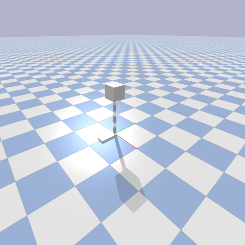

# Hopping Robot Gym
This implements an OpenAI gym environment for [Dan Lynch's](https://robotics.northwestern.edu/people/profiles/students/lynch-dan.html) hopping robot. The research is motivated and further described in this [paper](https://ieeexplore.ieee.org/document/9018262). Below is an image of the robot as it is starting an episode in Bullet.  

# Reward Function
Creating a reward function for the robot to follow is pretty tough! The agent often finds an unexpected but valid way to get high scores but also not really accomplish your original, semantic goal. You get what you incentivize, not what you intend! The simplest way to incentivize the agent is to give very sparse rewards. This means the agent gets no real reward until it reaches the desired goal state of the Markov Decesion Process. The downside to this approach is that the sparsity of the reward signal makes it much harder for the agent to learn. It needs to stumble upon the goal state a few times before it can learn to reach it. A good idea is to have some more regular rewards to nudge the agent toward the desired goal state. In our case, we want the Hopper robot to learn how to translate itself in the forward X direction. We could give intermediate rewards which are proportional to the agent's X-position. Although, this can have some unintended consequences. The agent learns to launch itself in the forward X direction rather than hopping, landing, and hopping again. Below is a gif of the launching policy.      
As an outside observer, we know the best policy is to hop, land, and repeat. The agent found a local minimum of the loss function and can spend quite a while there before it finds a lower minimum elsewhere in the weight space.  

So! You're probably thinking, why not incentivize the agent to stay alive as well. So the agent's reward would be some function of it's X-position and the number of steps in the epoch. This is a good idea but also prone to errors. The agent learns that if it stands still, it can collect reward indefinitely. . So, we must find some delicate balance between staying alive and moving forward. Add this to the list of hyper-parameters for Deep Reinforcement Learning algorithms!   

# Notes on Creating a Custom Gym Environment 
A great tutorial of how to create a custom gym environment can be found [here](https://medium.com/@apoddar573/making-your-own-custom-environment-in-gym-c3b65ff8cdaa)

# Bullet Documentation
The PyBullet documentation can be found [here](https://docs.google.com/document/d/10sXEhzFRSnvFcl3XxNGhnD4N2SedqwdAvK3dsihxVUA/edit#)

# testGym.py
This Python script simply launches the OpenAI Gym environment and tests it. You should see the robot show up in the PyBullet environment.

# setup.py
This is required boilerplate for the OpenAI gym. 
