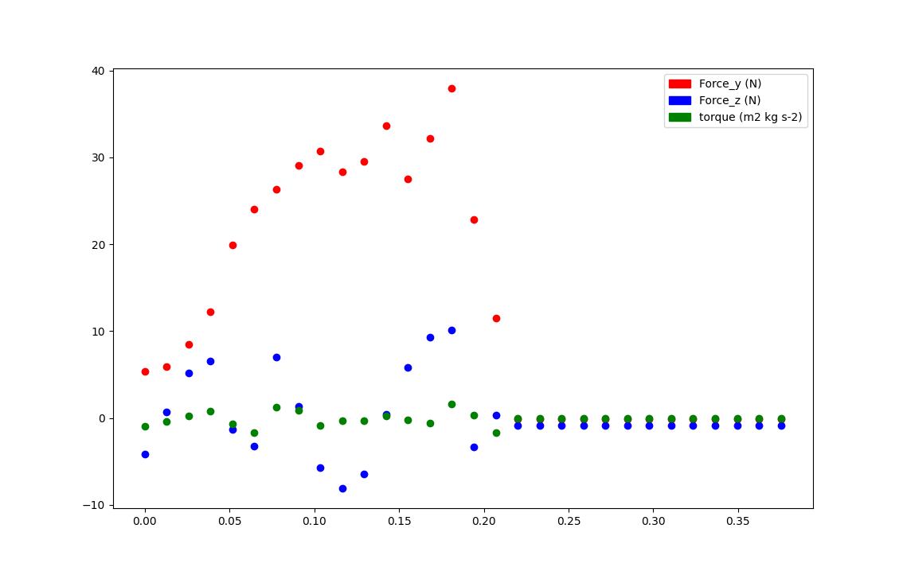

# H3pper PMTG 
This is an implementation of a [Policies Modulating Trajectories Generators](https://arxiv.org/abs/1910.02812) architecture for my h3pper robot in PyBullet. The original PMTG paper used a trajectory generator that output positions over time. I am using a wrench generator instead. [Dan Lynch](https://robotics.northwestern.edu/people/profiles/students/lynch-dan.html) has done a lot of amazing work to create an optimal controller for monopeds. His controller outputs the wrench we should apply at the foot over time. His model is for monopeds moving in a plane. He helped me adapt his wrench generator for a PMTG style architecture.    

# Architecture Overview 
The optimal wrench controller takes in the initial state of the robot and outputs an open loop controller specifying what wrenches for the robot's foot to apply in order to have a stable forward gait. The open loop controller was developed by Dan Lynch and requires a Matlab collocation package. Moreover, it requires a good initial guess in order to find a solution. So, we generated a single open loop wrench generator from Dan's model. It can be thought of as being defined by three curves. Each curve is a single component of the planar wrench vector over time. Each curve has N points that define what that wrench component as time progresses. N becomes another hyper-parameter to be tuned. The agent can move each of these N points within a small region. How big a region to allow the agent to change the wrench generator's points becomes another hyper-parameter to be tuned. This gives the agent a way to efficiently modify the underlying wrench generator. Then, given a time, for each curve, we can interpolate between the nearest two points. This allows us to efficiently map a time to a wrench with Dan's optimal controller. So, the open loop optimal controller outputs a planar wrench at each time step that the policy network can further modulate with residual terms. This planar wrench is then mapped down to a set of joint torques for the robot to apply. The policy network then uses DDPG to learn how to set the wrench generator parameters and apply resdidual terms. Below is a flowchart of the architecture.   
 

## More on Dan's Optimal Wrench Controller 
Dan Lynch has done a lot of amazing work creating optimal controllers for legged robots on soft ground. His controllers are open loop and map a time to a wrench for the robot's foot to apply. Below is a plot of the wrench controller over one period of the gait, that is one hop phase and one flight phase. During the flight phase, the robot's foot applies the zero wrench. Each curve has N points. These N points define the wrench generator. The agent can move each point within a small region in order to modulate the wrench generator.  

# Results
I have yet to get the robot to learn to hop with the PMTG architecture but we keep trying. 

