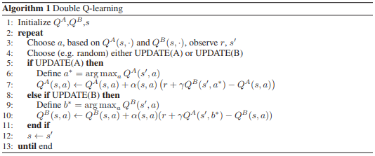

# Description 
This is an implementation of Double Deep-Q Learning as described in https://arxiv.org/abs/1509.06461. I had implemented Deep Q Learning in the past and wanted to try a slightly more interesting reinforcement learning algorithm. I wanted to implement D-DQN for the Atari brickbreaker environment. As a testing and debugging strategy, I started with the cart-pole environment in order to more quickly tweak my algorithm and be able to to see the results. From the reading I have done online, it should take a day or a few days of training in the Brick-Breaker environment. 

# D-DQN

# Issues Addressed by Double Deep Q Learning
Double Deep Q Learning is an improves over DQN by using two neural networks. There is the original online network for choosing actions and then a target network used to evaulate the value of given each action from a given state. The target is updated every k training cycles, where k is a hyperparameter. On the kth training cycle, the weights of the online network are copied to the target network. The online network has its weights updated as usual. We have decoupled the action selection and the value estimation. This has two benefits. 

One, the target values of our experiences are determined by the target network. This network changes slowly, and so the target values are more stable. In DQN, as soon as we do gradient descent in the weight space of the neural network, we actually change the target values of our experiences and so change the loss function. We have a circular dependency. The target values are computed using the neural network, and the loss function is computed using those target values. So, as we change the weights of the neural network, we change both the target values and the loss function surface which we want to find a local minima of. This causes the network to be relatively unstable. Double Deep Q Learning's target network changes slowly allowing us to move towards a local minima on the same loss surface before changing the surface itself, on the kth training cycle. This helps make our training more stable.

The second improvement that using two networks does is that it mitigates the bias we have for overestimated values. We use the neural network to estimate the values of taking certain actions in certain states. We then choose the action with the greatest estimated value, but this has a strong bias to choosing actions which overestimate the value of a given action. We decouple the action selection and the action evaluation in order to decrease this bias. Re-read and describe this better

# Results
## Brickbreaker 
Insert Image
Insert Matplotlib graph of the the learning

## Pong 

## Cart Pole

